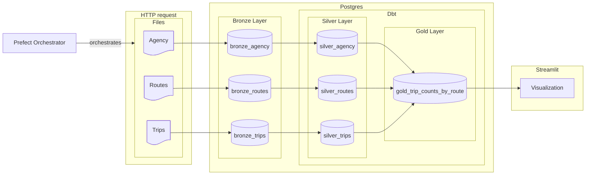
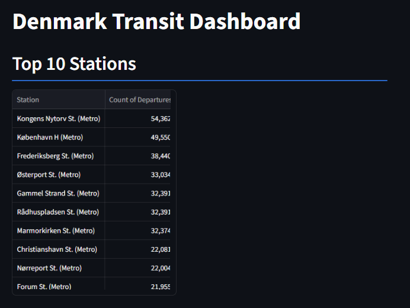
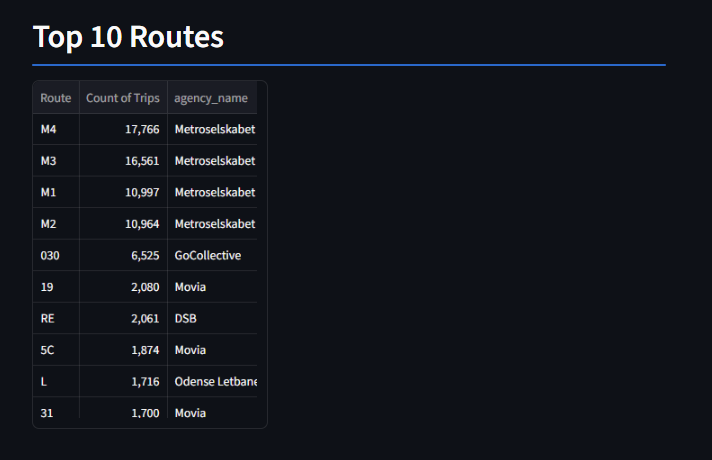
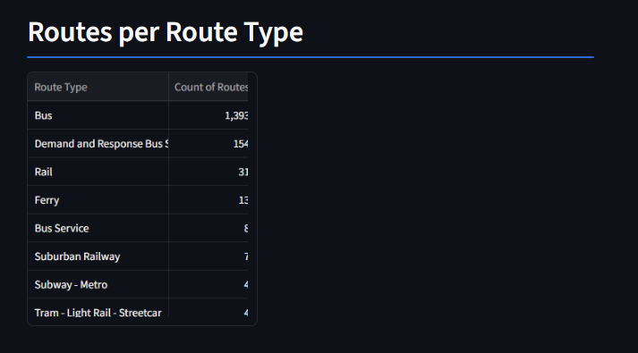

# denmark-transit-etl


An ETL pipeline for fetching and analyzing public transit data for Denmark from GTFS feeds.

## Architecture



The project is following the [Medallion architecture](https://www.databricks.com/blog/what-is-medallion-architecture) with bronze-silver-gold layers.

- Fetches GTFS data as a zip file from [Rejseplannen](https://labs.rejseplanen.dk/hc/da/articles/21639730766877-Om-GTFS-Schedule-Static) site via HTTP request
- Hashes the feed and checks version before re-ingesting the same feed
- Extracts and stores the zip file temporarily in a landing zone (/temp)
- Stores raw tables as bronze layer in [PostgreSQL](https://www.postgresql.org/) database - uses Alembic for schema migrations
- Seeds a csv file with the [full list](https://developers.google.com/transit/gtfs/reference/extended-route-types) of route types for reference
- [Dbt](https://www.getdbt.com/) handles the transformations and tests for silver layer storing the tables on PostgreSQL database
- Dbt also handles queries and aggregations for gold layer tables
- Hosts a simple UI locally by a [Streamlit](https://streamlit.io/) server
- Orchestrates the whole pipeline with [Prefect](https://www.prefect.io/)

## Screenshots





## Prerequisites

[Docker](https://www.docker.com/get-started/) must be installed to build and run the container.

## Usage

Copy .env example and update Postgres credentials

```bash
cp .env.example .env
```

Build and run docker container

```bash
docker compose build
docker compose up
```

> **_NOTE:_** app will be served on <http://localhost:8501/>

## Project structure

| Path | Description |
| --- | --- |
| `orchestration/etl.py` | Prefect flow — orchestrates the end-to-end pipeline (migrations → fetch → bronze → seed → silver → gold) |
| `infra/gtfs/` | Fetches and extracts the GTFS feed from Rejseplannen |
| `pipelines/ingestion/` | Loads extracted GTFS files into the bronze layer in PostgreSQL |
| `alembic/` | Database schema migrations (bronze table definitions) |
| `models/` | Dbt models for the silver and gold layers, plus schema/source tests |
| `macros/` | Dbt macros shared across models |
| `seeds/` | Dbt seed data (GTFS route type reference list) |
| `config/` | YAML schema definitions for bronze/silver tables |
| `dashboard/` | Streamlit app serving the gold-layer dashboard |
| `tests/` | Pytest tests for the ingestion pipeline |
| `compose.yaml` | Docker Compose services: Postgres, ETL, and the dashboard app |
| `Dockerfile.etl` / `Dockerfile.app` | Container images for the ETL pipeline and the dashboard |

## Roadmap

- [ ] Host the pipeline on [Prefect Cloud](https://www.prefect.io/prefect/cloud) for scheduled runs
- [ ] Add more visualizations on the UI
- [ ] Add a cli for manual on demand triggering of the ETL pipeline
- [ ] Database migration to [Snowflake](https://www.snowflake.com/en/) or [Databricks](https://www.databricks.com/)
- [ ] Use live transit data using [Rejseplannen API](https://labs.rejseplanen.dk/hc/da/articles/21554723926557-Om-API-2-0)

## License

[MIT](https://chooselicense.com/licenses/mit/)
